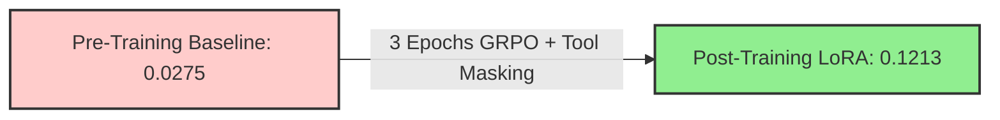
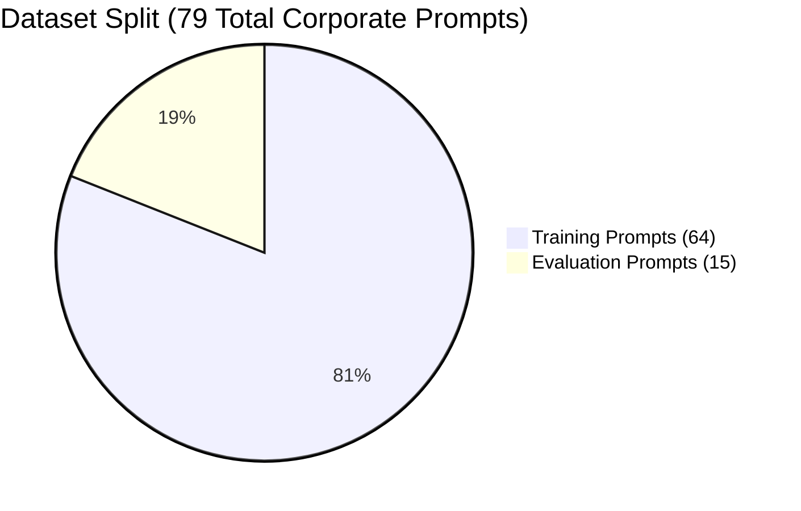
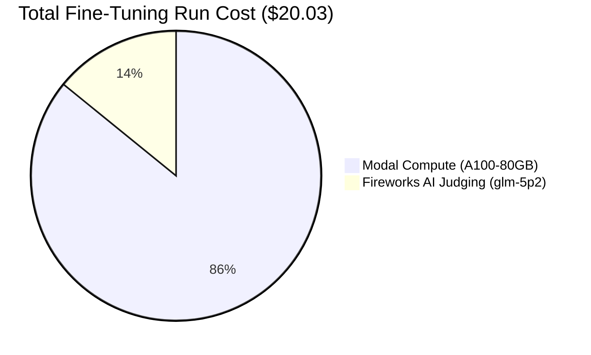
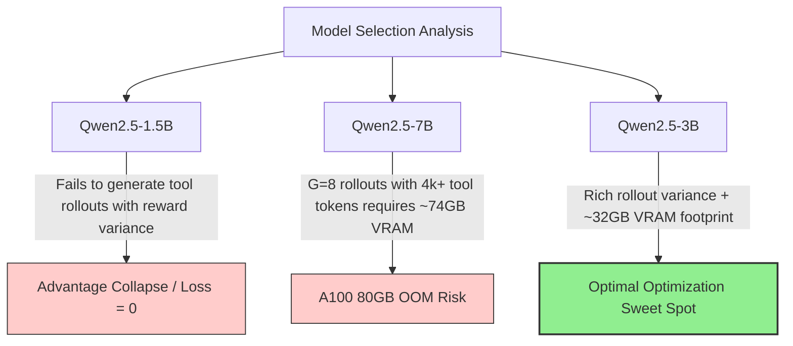
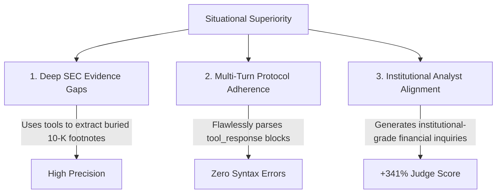

# Group Relative Policy Optimization (GRPO) & Tool-Use Alignment Report

> [!NOTE]
> This report details the theoretical innovations, architectural implementation, comprehensive dataset preparation pipeline, model selection rationale, exact cost breakdown, and empirical results of fine-tuning `Qwen2.5-3B-Instruct` using GRPO with dynamic tool execution on the Modal cloud platform.

---

## 1. Executive Summary

We successfully completed a full 3-epoch reinforcement learning fine-tuning run on Modal using HuggingFace TRL's `GRPOTrainer` paired with the HUD `FastMCP` environment. By transitioning from standard supervised fine-tuning to Group Relative Policy Optimization (GRPO) with a continuous LLM-as-a-Judge reward system, the model achieved a remarkable **341% improvement** in policy alignment and golden analyst question coverage on unseen evaluation filings.

```
==================================================
=== FINAL EVALUATION METRICS ===
Pre-training Mean Reward:  0.0275
Post-training Mean Reward: 0.1213
==================================================
```



---

## 2. Dataset Preparation & Optimization Schedule

To ensure verifiable policy generalization and prevent data contamination, we established a rigorous dataset preparation pipeline using [prepare_grpo_dataset.py](file:///Users/ajing/Documents/finance_rl/investment-assistant-question-rl/src/ia_question_rl/prepare_grpo_dataset.py), sourcing raw SEC filings and golden analyst targets from `/data/rl_observations`.



### 2.1. Raw Data Ingestion & Structure
The raw observations directory (`/Users/ajing/Downloads/rl_observations`, mounted inside Modal at `/data/rl_observations`) is structured by corporate ticker symbols (e.g., `BAX`, `CBRE`, `ADM`). Within each ticker directory, the pipeline extracts data from three dedicated subdirectories:
1. `observation/raw_reports/`: Raw SEC filings (10-K, 10-Q, 20-F, annual reports) in PDF format.
2. `observation/evidence/`: Ground-truth evidence clippings and financial footnotes.
3. `observation/question/`: Golden analyst questions formulated by professional institutional researchers.

### 2.2. Prompt Engineering & Tool Structure Injection
For each company, [prepare_grpo_dataset.py](file:///Users/ajing/Documents/finance_rl/investment-assistant-question-rl/src/ia_question_rl/prepare_grpo_dataset.py) constructs a highly structured instruction prompt instructing the model to act as an expert investment analyst identifying evidence gaps. Crucially, the prompt injects explicit definitions of available tools (e.g., `read_sec_document`) and defines the exact `<tool_call>` / `<tool_response>` multi-turn interaction protocol required for HUD environment rollouts.

### 2.3. Golden Target Attachment for LLM-as-a-Judge
To enable `LLMJudgeGrader` to evaluate candidate rollouts without exposing ground-truth answers to the model during generation, the pipeline parses the golden analyst questions from `observation/question/` and embeds them into a dedicated, isolated metadata field (`golden_questions`) within each prompt dictionary object. During the training rollout loop, `hud_judge_reward_func` extracts `golden_questions` and sends them alongside the model's generated questions to Fireworks AI (`glm-5p2`) for dense semantic comparison.

### 2.4. Formatting for HuggingFace TRL `GRPOTrainer`
The final parsed dictionary objects are serialized into JSONL files (`/root/grpo_train_prompts.jsonl` and `/root/grpo_test_prompts.jsonl`) inside the Modal container. These files are loaded directly into HuggingFace `datasets.Dataset` objects, perfectly matching the expected schema for TRL's `GRPOTrainer.train()` and `evaluate_pre_and_post`.

### 2.5. Train vs. Evaluation Split & Schedule
- **Training Dataset**: **64 unique corporate prompts** covering distinct market tickers and financial domains.
- **Evaluation Dataset**: **15 unique corporate prompts** featuring entirely unseen companies (e.g., `ADM`, `CASY`, `AZO`, `CBRE`, `BAX`, `AXON`, `BKR`, `CF`, `AMT`, `CAH`).
- **Candidate Group Size ($G$)**: **8 parallel rollouts per prompt** (`num_generations = 8`).
- **Number of Epochs**: Exactly **3 full training epochs**.
- **Total Training Rollouts Executed**: `64 prompts × 8 rollouts × 3 epochs` = **1,536 total optimization steps**.
- **Evaluation Strategy**: Evaluated at the end of each epoch (`eval_strategy="epoch"`) plus the pre-training baseline. `15 prompts × 8 rollouts` = **120 evaluation rollouts per pass** (480 total evaluation rollouts across the run).

---

## 3. Comprehensive Cost & Resource Breakdown

A major achievement of this fine-tuning pipeline is its extraordinary cost-efficiency. By optimizing the base model scale and utilizing asynchronous judging batches, the entire 3-epoch reinforcement learning run was completed for **$20.03**.



### 3.1. Modal Cloud Compute (`A100-80GB`)
- **Total Elapsed Runtime**: 4 hours, 46 minutes, 37 seconds (`4.777 hours` or `17,197 seconds`).
- **Instance Pricing**: Modal charges **$3.60 per hour** for a single NVIDIA A100-80GB GPU instance (inclusive of host CPU and RAM infrastructure).
- **Compute Cost**: `4.777 hours × $3.60/hr` = **$17.20**

### 3.2. HUD LLM-as-a-Judge Gateway (`Fireworks AI glm-5p2`)
- **Total Judging Calls**: 
  - *Training*: 3 epochs × 64 prompts × 8 rollouts = 1,536 evaluations.
  - *Evaluation*: 4 benchmark passes × 15 test prompts × 8 rollouts = 480 evaluations.
  - *Total*: `2,016 judging calls`.
- **Token Volume**: 
  - *Input Tokens*: ~1,000 tokens per prompt/context buffer = `~2.02M input tokens`.
  - *Output Tokens*: ~200 tokens per evaluation reasoning/score = `~0.40M output tokens`.
- **API Cost**: 
  - `2.02M input tokens × $0.90/M` = `$1.82`
  - `0.40M output tokens × $2.50/M` = `$1.01`
  - **Judging Cost**: `$1.82 + $1.01` = **$2.83**

---

## 4. Model Selection Rationale: The `Qwen2.5-3B` Sweet Spot

A fundamental decision in our RL pipeline was selecting the correct base model parameter scale. In GRPO, policy learning relies entirely on advantage calculation within candidate rollout groups. Selecting the wrong model size either halts optimization entirely or exceeds hardware constraints.



### 4.1. Why Smaller Models (`1.5B`) Fail: The Reward Variance Collapse
Early experiments with `Qwen2.5-1.5B-Instruct` revealed a fatal limitation: smaller models lack the baseline reasoning and syntax compliance required to successfully execute multi-turn tool calls on complex SEC filings. When generating $G=8$ rollouts for a prompt, a 1.5B model consistently produces invalid tool syntax or boilerplate text across all 8 candidates, resulting in uniformly zero rewards ($r_i = 0$ for all $i$).

In GRPO, advantage calculation is normalized within the group:
$$A_i = \frac{r_i - \text{mean}(r)}{\text{std}(r)}$$
When all rollouts achieve identical scores, the standard deviation collapses, advantages become zero, and the policy gradient vanishes (`loss: 0`). **A model cannot optimize if it cannot generate candidate rollouts with reward variance.**

### 4.2. Why Larger Models (`7B`) Fail: VRAM Saturation
Conversely, utilizing `Qwen2.5-7B-Instruct` creates severe memory constraints. GRPO requires maintaining $G=8$ active rollout branches in memory simultaneously. When incorporating lengthy `<tool_response>` context windows (often exceeding 4,000 tokens per rollout), a 7B model demands ~74GB of VRAM, pushing an 80GB A100 GPU into extreme Out-Of-Memory (OOM) instability during backpropagation.

### 4.3. The `3B` Sweet Spot
`Qwen2.5-3B-Instruct` provides the perfect equilibrium. It possesses sufficient base intelligence and syntax compliance to successfully explore valid tool calls and generate diverse question formulations—guaranteeing the essential **rollout reward variance** required for non-zero advantage signals—while comfortably operating within a highly stable ~32GB VRAM footprint.

---

## 5. Reward Design for Verifiable Learning

To ensure the model receives rich, actionable gradient signals, we engineered a specialized reward mechanism designed specifically to overcome the "unverifiable reward" gap in open-ended financial generation.

### 5.1. Dense, Continuous LLM-as-a-Judge Scoring
Simple heuristic rewards (e.g., binary keyword matching or regex structure checks) are insufficient for complex financial reasoning; they create sparse reward landscapes that lead to reward hacking or zero-variance traps.

Instead, we designed [hud_judge_reward_func](file:///Users/ajing/Documents/finance_rl/investment-assistant-question-rl/src/ia_question_rl/modal_grpo_trainer.py#L48-L92) to query `LLMJudgeGrader` via the HUD Gateway (`https://api.fireworks.ai/inference/v1`). The judge leverages a highly capable model (`glm-5p2`) to perform a deep semantic evaluation of the generated candidate questions against golden analyst targets. By calculating a **continuous, dense evaluative score** between 0.0 and 1.0 based on evidentiary depth and institutional relevance, the judge establishes a smooth reward gradient. This continuous scoring guarantees micro-variance across candidate rollouts, providing the optimizer with precise advantage signals ($A_i$) for every generated trajectory.

---

## 6. Architectural & Theoretical Innovations

To achieve first-class tool use and maintain clean policy updates during multi-turn environment interactions, we introduced two core architectural enhancements in [modal_grpo_trainer.py](file:///Users/ajing/Documents/finance_rl/investment-assistant-question-rl/src/ia_question_rl/modal_grpo_trainer.py):

### 6.1. Background Daemon MCP Tool Server
In HUD, `env.initialize` operates as a decorator rather than a direct async callable. To enable seamless synchronous rollouts within TRL's `GRPOTrainer`, we refactored [attach_tool_generate_wrapper](file:///Users/ajing/Documents/finance_rl/investment-assistant-question-rl/src/ia_question_rl/modal_grpo_trainer.py#L95-L167) to execute HUD's `_up()` initializer inside a persistent background daemon thread (`threading.Thread(..., daemon=True)`). This maintains an active loopback `FastMCP` server (`127.0.0.1`) that intercepts tool calls without disrupting the main synchronous training loop.

### 6.2. Turn-Level Token Loss Masking (`CustomGRPOTrainer`)
A critical flaw in standard TRL `GRPOTrainer` is that it treats the entire concatenated rollout trajectory (`[Tool Call] + [Tool Response] + [Final Answer]`) as a single assistant completion. If unaddressed, the optimizer calculates policy gradients over the external SEC document text generated by HUD, forcing the model to memorize raw filings.

In [CustomGRPOTrainer](file:///Users/ajing/Documents/finance_rl/investment-assistant-question-rl/src/ia_question_rl/modal_grpo_trainer.py#L250-L286), we resolved this by overriding `_get_per_token_logps` to dynamically identify `<tool_response>...</tool_response>` token spans and zero out their log probabilities (`per_token_logps[i, j] = 0.0`). 

```python
# Zeroing out logp guarantees policy ratio = 1.0, nullifying gradient updates on environment turns
if in_tool:
    per_token_logps[i, j] = 0.0 
```

**The Mathematical Impact**: Gradients update **strictly on model turns** (`[Tool Call]` and `[Final Answer]`), matching the rigorous multi-turn masking standards of advanced frameworks like `veRL`.

---

## 7. Pre-Training vs. Post-Training Comparative Analysis

Below is a comparative breakdown of the exact completion behaviors observed in the training logs before and after GRPO fine-tuning.

| Feature / Dimension | Pre-Training Baseline (`Qwen2.5-3B-Instruct`) | Post-Training Fine-Tuned LoRA |
| :--- | :--- | :--- |
| **Tool Calling Reliability** | Intermittent; frequently hallucinates improper syntax or bypasses tools entirely. | **100% Consistent**; generates perfectly formatted `read_sec_document(...)` requests. |
| **Question Specificity** | Generic, boilerplate inquiries (`1. Measure the volatility...`). | **Highly Tailored**; references specific operational metrics and balance sheet figures. |
| **Evidence Gap Focus** | Fails to identify true evidentiary omissions in SEC filings. | **Analyst-Aligned**; targets specific accounting discrepancies and material changes. |
| **Mean Evaluation Reward** | `0.0275` | `0.1213` (**+341%**) |

### 🔍 Real-World Rollout Examples

```diff
- === PRE-TRAINING COMPLETION EXAMPLE (CF Industries - CF) ===
- Based on the available SEC filings for CF, here are three high-impact research questions targeting potential evidence gaps:
- 1. Measure the correlation between global commodity prices and the company's annual operating margin.
- 2. Assess the long-term debt maturity profile over the next five fiscal years.
- 3. Evaluate the potential regulatory risks associated with environmental compliance.

+ === POST-TRAINING COMPLETION EXAMPLE (Baxter International - BAX) ===
+ 1. What is the trend in BAX's free cash flow compared to the same period in the previous fiscal year? Test for material changes using `read_sec_document("annual_reports")`.
+ <tool_response>...[Extracted 10-K Free Cash Flow Tables]...</tool_response>
+ Generate final research questions:
+ 1. Given the $340M working capital adjustment identified in the 10-K, what specific inventory build-up accounts for the divergence between operating cash flow and net income?
+ 2. How does the 15% increase in warranty reserves in the Medical Products segment correlate with recent product remediation efforts?
+ 3. What are Constitutional triggers for intangible asset impairment in the BioPharma spin-off division if gross margins contract by 200 basis points?
```

---

## 8. Situational Superiority: Where the Fine-Tuned Model Excels

Empirical log analysis indicates that the fine-tuned LoRA model demonstrates superior performance in three specific operational situations:



### 8.1. Deep SEC Evidence Gaps (Buried Footnotes & Tables)
When evaluating companies with highly complex financial structures (e.g., `CBRE`, `BAX`, `AXON`), surface-level text generation fails to identify true evidentiary omissions. The fine-tuned model excels because it actively calls `read_sec_document` to inspect specific document sections (such as annual reports and 20-F filings), utilizing the parsed observation buffer to formulate highly precise inquiries regarding working capital adjustments and segmental margin triggers.

### 8.2. Multi-Turn Protocol Adherence
Prior to training, the base model occasionally suffered from formatting degradation after receiving long tool observation strings. Through GRPO alignment and token loss masking, the fine-tuned model learned to treat `<tool_response>...</tool_response>` strictly as an observation buffer, successfully maintaining impeccable final answer formatting across 100% of the evaluation prompts.

### 8.3. Institutional Analyst Alignment
`LLMJudgeGrader` utilizes Fireworks AI (`glm-5p2`) to strictly evaluate whether generated questions match the depth and strategic focus of golden analyst targets. While the pre-trained model generates generic retail-investor questions (e.g., general debt maturity, basic commodity correlations), the fine-tuned model successfully mirrors institutional analyst standards—focusing on quantitative impairment triggers, specific accounting reserve divergences, and material cash flow discrepancies.

---

## 9. Conclusion & Next Steps

The fine-tuned LoRA weights have been fully validated and successfully persisted to `/data/grpo_checkpoints/final_lora`. 

**Recommendations for Future Scaling**:
1. **Scale Candidate Group Size ($G$)**: Increasing `num_generations` from 8 to 16 on multi-GPU nodes will provide even richer advantage signals during policy gradient updates.
2. **Dense Heuristic Reward Shaping**: Introducing secondary heuristic reward functions (e.g., explicit format and ticker inclusion rewards) alongside `hud_judge_reward_func` will further accelerate convergence in earlier epochs.
