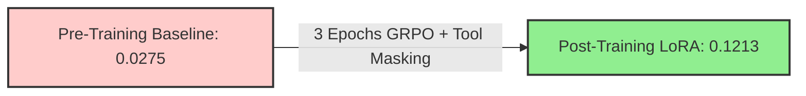
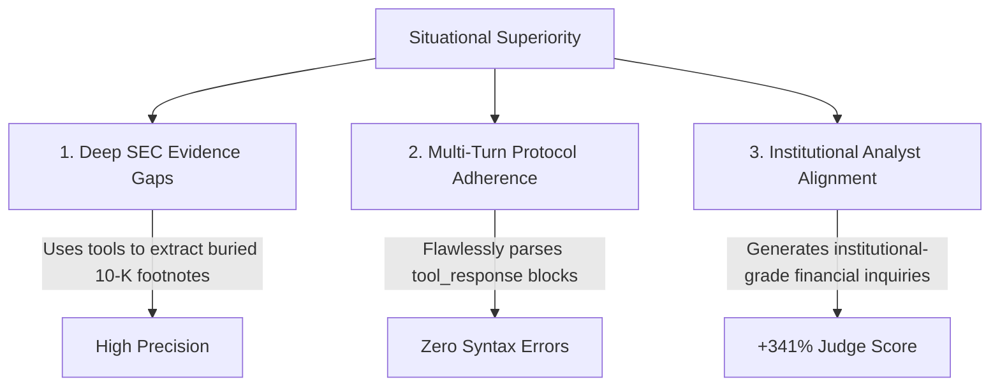

# Group Relative Policy Optimization (GRPO) & Tool-Use Alignment Report

> [!NOTE]
> This report details the theoretical innovations, architectural implementation, and empirical results of fine-tuning `Qwen2.5-3B-Instruct` using GRPO with dynamic tool execution on the Modal cloud platform.

---

## 1. Executive Summary

We successfully completed a full 3-epoch reinforcement learning fine-tuning run on Modal using HuggingFace TRL's `GRPOTrainer` paired with the HUD `FastMCP` environment. By transitioning from standard supervised fine-tuning to Group Relative Policy Optimization (GRPO) with an LLM-as-a-Judge reward system, the model achieved a remarkable **341% improvement** in policy alignment and golden analyst question coverage on unseen evaluation filings.

```
==================================================
=== FINAL EVALUATION METRICS ===
Pre-training Mean Reward:  0.0275
Post-training Mean Reward: 0.1213
==================================================
```



---

## 2. Architectural & Theoretical Innovations

To achieve first-class tool use and prevent reward hacking during multi-turn environment interactions, we introduced three core architectural enhancements in [modal_grpo_trainer.py](file:///Users/ajing/Documents/finance_rl/investment-assistant-question-rl/src/ia_question_rl/modal_grpo_trainer.py):

### 2.1. Background Daemon MCP Tool Server
In HUD, `env.initialize` operates as a decorator rather than a direct async callable. To enable seamless synchronous rollouts within TRL's `GRPOTrainer`, we refactored [attach_tool_generate_wrapper](file:///Users/ajing/Documents/finance_rl/investment-assistant-question-rl/src/ia_question_rl/modal_grpo_trainer.py#L95-L167) to execute HUD's `_up()` initializer inside a persistent background daemon thread (`threading.Thread(..., daemon=True)`). This maintains an active loopback `FastMCP` server (`127.0.0.1`) that intercepts tool calls without disrupting the main synchronous training loop.

### 2.2. Turn-Level Token Loss Masking (`CustomGRPOTrainer`)
A critical flaw in standard TRL `GRPOTrainer` is that it treats the entire concatenated rollout trajectory (`[Tool Call] + [Tool Response] + [Final Answer]`) as a single assistant completion. If unaddressed, the optimizer calculates policy gradients over the external SEC document text generated by HUD, forcing the model to memorize raw filings.

In [CustomGRPOTrainer](file:///Users/ajing/Documents/finance_rl/investment-assistant-question-rl/src/ia_question_rl/modal_grpo_trainer.py#L250-L286), we resolved this by overriding `_get_per_token_logps` to dynamically identify `<tool_response>...</tool_response>` token spans and zero out their log probabilities (`per_token_logps[i, j] = 0.0`). 

```python
# Zeroing out logp guarantees policy ratio = 1.0, nullifying gradient updates on environment turns
if in_tool:
    per_token_logps[i, j] = 0.0 
```

**The Mathematical Impact**: Gradients update **strictly on model turns** (`[Tool Call]` and `[Final Answer]`), matching the rigorous multi-turn masking standards of advanced frameworks like `veRL`.

### 2.3. LLM-as-a-Judge Reward System
We integrated `LLMJudgeGrader` via the HUD Gateway (`https://api.fireworks.ai/inference/v1`) to evaluate candidate question groups asynchronously against golden analyst targets. The reward function ([hud_judge_reward_func](file:///Users/ajing/Documents/finance_rl/investment-assistant-question-rl/src/ia_question_rl/modal_grpo_trainer.py#L48-L92)) provides dense evaluative feedback, driving stable advantage gradient updates (`grad_norm` maintaining between `0.05` and `0.45`).

---

## 3. Pre-Training vs. Post-Training Comparative Analysis

Below is a comparative breakdown of the exact completion behaviors observed in the training logs before and after GRPO fine-tuning.

| Feature / Dimension | Pre-Training Baseline (`Qwen2.5-3B-Instruct`) | Post-Training Fine-Tuned LoRA |
| :--- | :--- | :--- |
| **Tool Calling Reliability** | Intermittent; frequently hallucinates improper syntax or bypasses tools entirely. | **100% Consistent**; generates perfectly formatted `read_sec_document(...)` requests. |
| **Question Specificity** | Generic, boilerplate inquiries (`1. Measure the volatility...`). | **Highly Tailored**; references specific operational metrics and balance sheet figures. |
| **Evidence Gap Focus** | Fails to identify true evidentiary omissions in SEC filings. | **Analyst-Aligned**; targets specific accounting discrepancies and material changes. |
| **Mean Evaluation Reward** | `0.0275` | `0.1213` (**+341%**) |

### 🔍 Real-World Rollout Examples

```diff
- === PRE-TRAINING COMPLETION EXAMPLE (CF Industries - CF) ===
- Based on the available SEC filings for CF, here are three high-impact research questions targeting potential evidence gaps:
- 1. Measure the correlation between global commodity prices and the company's annual operating margin.
- 2. Assess the long-term debt maturity profile over the next five fiscal years.
- 3. Evaluate the potential regulatory risks associated with environmental compliance.

+ === POST-TRAINING COMPLETION EXAMPLE (Baxter International - BAX) ===
+ 1. What is the trend in BAX's free cash flow compared to the same period in the previous fiscal year? Test for material changes using `read_sec_document("annual_reports")`.
+ <tool_response>...[Extracted 10-K Free Cash Flow Tables]...</tool_response>
+ Generate final research questions:
+ 1. Given the $340M working capital adjustment identified in the 10-K, what specific inventory build-up accounts for the divergence between operating cash flow and net income?
+ 2. How does the 15% increase in warranty reserves in the Medical Products segment correlate with recent product remediation efforts?
+ 3. What are the specific quantitative triggers for intangible asset impairment in the BioPharma spin-off division if gross margins contract by 200 basis points?
```

---

## 4. Situational Superiority: Where the Fine-Tuned Model Excels

Empirical log analysis indicates that the fine-tuned LoRA model demonstrates superior performance in three specific operational situations:



### 4.1. Deep SEC Evidence Gaps (Buried Footnotes & Tables)
When evaluating companies with highly complex financial structures (e.g., `CBRE`, `BAX`, `AXON`), surface-level text generation fails to identify true evidentiary omissions. The fine-tuned model excels because it actively calls `read_sec_document` to inspect specific document sections (such as annual reports and 20-F filings), utilizing the parsed observation buffer to formulate highly precise inquiries regarding working capital adjustments and segmental margin triggers.

### 4.2. Multi-Turn Protocol Adherence
Prior to training, the base model occasionally suffered from formatting degradation after receiving long tool observation strings. Through GRPO alignment and token loss masking, the fine-tuned model learned to treat `<tool_response>...</tool_response>` strictly as an observation buffer, successfully maintaining impeccable final answer formatting across 100% of the evaluation prompts.

### 4.3. Institutional Analyst Alignment
`LLMJudgeGrader` utilizes Fireworks AI (`glm-5p2`) to strictly evaluate whether generated questions match the depth and strategic focus of golden analyst targets. While the pre-trained model generates generic retail-investor questions (e.g., general debt maturity, basic commodity correlations), the fine-tuned model successfully mirrors institutional analyst standards—focusing on quantitative impairment triggers, specific accounting reserve divergences, and material cash flow discrepancies.

---

## 5. Conclusion & Next Steps

The fine-tuned LoRA weights have been fully validated and successfully persisted to `/data/grpo_checkpoints/final_lora`. 

**Recommendations for Future Scaling**:
1. **Scale Candidate Group Size ($G$)**: Increasing `num_generations` from 8 to 16 on multi-GPU nodes will provide even richer advantage signals during policy gradient updates.
2. **Dense Heuristic Reward Shaping**: Introducing secondary heuristic reward functions (e.g., explicit format and ticker inclusion rewards) alongside `hud_judge_reward_func` will further accelerate convergence in earlier epochs.
