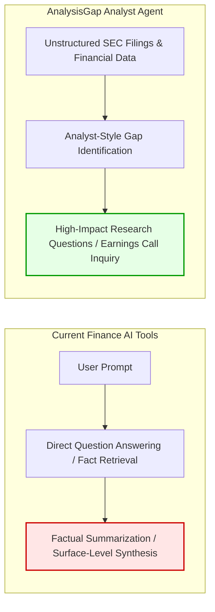

# AnalysisGap: Building an Analyst Agent for Expert Gap Identification & Critical Inquiry via GRPO

## 🚀 Quick Pitch
- **Project Name**: AnalysisGap
- **Tagline**: We are teaching AI to ask the questions that great financial analysts ask: what is missing, what does not add up, and what could change the investment story.
- **Short Description**: Our goal is to build an analyst agent that behaves like a seasoned financial analyst by identifying gaps in a company’s narrative, surfacing unanswered questions, and pointing to issues that deserve deeper research. This matters because the quality of financial analysis is often limited by the quality of the questions being asked. The most important investment insights often come from noticing what management has not fully explained, where the numbers and narrative do not align, or which assumptions need to be tested over time. While many finance AI tools focus on retrieving facts, generating summaries, or answering direct questions, analyst-style gap identification remains relatively underexplored. To explore this, we introduce a reinforcement learning framework powered by Group Relative Policy Optimization, GRPO, that teaches models to investigate unstructured SEC filings, identify evidence gaps, and generate forward-looking, high-impact research questions like those asked by elite equity research analysts during earnings calls.

---

## 1. Why We Do It: The Financial Analysis Quality Gap

### The Quality of Analysis Depends on the Questions Asked
The quality of financial analysis is often limited by the quality of the questions being asked. Today's finance AI tools focus heavily on retrieving facts, generating summaries, or answering direct user questions. However, in high-stakes professional investment research, the most challenging and valuable capability is **not answering a direct question, but knowing what question to ask in the first place**.

### Finding Alpha Where Numbers and Narrative Misalign
The most important investment insights often come from noticing what management has not fully explained, where the numbers and narrative do not align, or which assumptions need to be tested over time. Conventional AI tools operate passively—they wait for explicit user direction and summarize existing disclosures. This creates an illusion of understanding while burying critical risks, accounting anomalies, and underlying growth drivers.

### Pioneering Analyst-Style Gap Identification
While factual retrieval and summarization are well-served by existing finance AI tools, analyst-style gap identification remains relatively underexplored. By training models to behave like seasoned financial analysts—actively investigating unstructured SEC filings, identifying evidence gaps, and formulating rigorous, forward-looking inquiries—we are bridging the gap between basic information retrieval and high-impact investment research.

---

## 2. What We Do: Data, Labels & The Evaluation Standard

We build a training and evaluation pipeline for research-question generation.
The input data is company-level investment research context, such as financial reports, SEC filings, earnings call transcripts, and other structured outputs from the InvestmentAssistant system.
The output data is a set of candidate research questions generated by the model. These questions should help an investor investigate the company more deeply, identify key uncertainties, and decide what evidence should be collected next.
For labels and supervision, we use analyst questions from earnings call Q&A sessions. These questions are useful because they represent real questions asked by professional investors and sell-side analysts in live company research settings.
The goal is to improve the model’s output questions through RL training, so the model learns to generate questions that are more specific, investment-relevant, evidence-seeking, and similar in quality to real analyst research questions.

---

## 3. How We Did It: System Architecture, Reward Modeling & GRPO

We train the model with a constrained question-generation task: given company research context, it should generate a small set of questions, usually 3 to 5.
The labels are real analyst questions from earnings call Q&A. An LLM judge compares the generated questions with these golden analyst questions.
The reward is not for generating more questions. It is for asking questions that capture the same research idea, business issue, and level of nuance as the analyst questions, while staying concise.
We then use this reward signal in GRPO-style RL training to improve the model’s question-generation policy.

---

## 4. Hackathon Fast Facts & Summary Table

| Dimension | Implementation Details |
| :--- | :--- |
| **Primary Objective** | Build an analyst agent that behaves like a seasoned financial analyst by identifying narrative gaps and generating high-impact research questions. |
| **Core Philosophy** | Move beyond basic fact retrieval & summarization to analyst-style gap identification and forward-looking inquiry. |
| **Input Data & State** | SEC EDGAR Filings (10-K, 20-F, 6-K) + structured `financial_report_pack.json` & `EvidenceGap` artifacts. |
| **Ground Truth Labels** | Real analyst questions from quarterly Earnings Calls. |
| **Reward Model** | Dense, inspectable distribution scoring $M/N$ golden coverage (`LLMJudgeGrader`) + novelty & gap-fit. |
| **RL Algorithm** | GRPO (Group Relative Policy Optimization) via HuggingFace `trl` & LoRA adapters. |
| **Infrastructure Stack** | `modal` GPU containers, `hud` evaluation gateways, `fireworks` RFT fine-tuning, `daytona` envs. |
| **Current Status** | RL infrastructure, reward rubric, and GRPO training pipeline fully built; active model training underway. |
