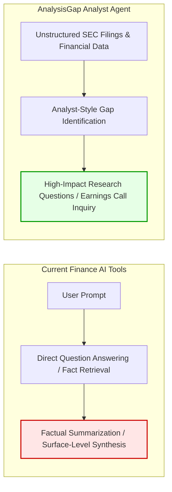
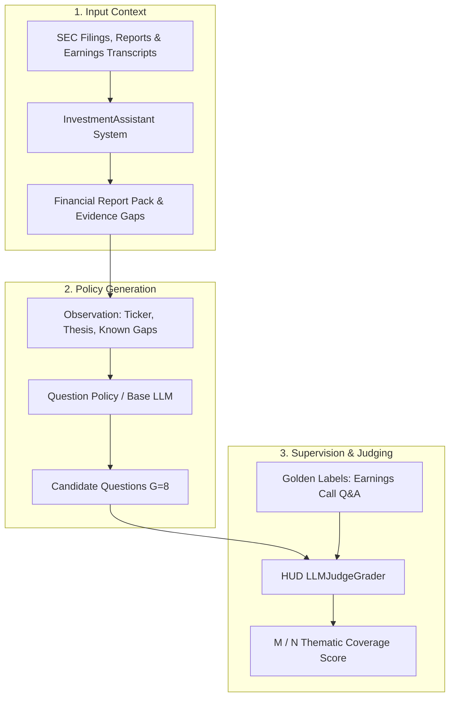

# AnalysisGap: Building an Analyst Agent for Expert Gap Identification & Critical Inquiry via GRPO

## 🚀 Quick Pitch
- **Project Name**: AnalysisGap
- **Tagline**: We are teaching AI to ask the questions that great financial analysts ask: what is missing, what does not add up, and what could change the investment story.
- **Short Description**: Our goal is to build an analyst agent that behaves like a seasoned financial analyst by identifying gaps in a company’s narrative, surfacing unanswered questions, and pointing to issues that deserve deeper research. This matters because the quality of financial analysis is often limited by the quality of the questions being asked. The most important investment insights often come from noticing what management has not fully explained, where the numbers and narrative do not align, or which assumptions need to be tested over time. While many finance AI tools focus on retrieving facts, generating summaries, or answering direct questions, analyst-style gap identification remains relatively underexplored. To explore this, we introduce a reinforcement learning framework powered by Group Relative Policy Optimization, GRPO, that teaches models to investigate unstructured SEC filings, identify evidence gaps, and generate forward-looking, high-impact research questions like those asked by elite equity research analysts during earnings calls.

---

## 1. Why We Do It: The Financial Analysis Quality Gap



### The Quality of Analysis Depends on the Questions Asked
The quality of financial analysis is often limited by the quality of the questions being asked. Today's finance AI tools focus heavily on retrieving facts, generating summaries, or answering direct user questions. However, in high-stakes professional investment research, the most challenging and valuable capability is **not answering a direct question, but knowing what question to ask in the first place**.

### Finding Alpha Where Numbers and Narrative Misalign
The most important investment insights often come from noticing what management has not fully explained, where the numbers and narrative do not align, or which assumptions need to be tested over time. Conventional AI tools operate passively—they wait for explicit user direction and summarize existing disclosures. This creates an illusion of understanding while burying critical risks, accounting anomalies, and underlying growth drivers.

### Pioneering Analyst-Style Gap Identification
While factual retrieval and summarization are well-served by existing finance AI tools, analyst-style gap identification remains relatively underexplored. By training models to behave like seasoned financial analysts—actively investigating unstructured SEC filings, identifying evidence gaps, and formulating rigorous, forward-looking inquiries—we are bridging the gap between basic information retrieval and high-impact investment research.

---

## 2. What We Do: Data, Labels & The Evaluation Standard

We build an end-to-end training and evaluation pipeline for high-impact research-question generation. Our goal is to improve the model’s output questions through reinforcement learning (RL) training, so the model learns to generate questions that are more specific, investment-relevant, evidence-seeking, and similar in quality to real analyst research questions.



### Input Data: Realistic Investment Context
Our input data consists of rich, company-level investment research context. Using the dedicated `InvestmentAssistant` system, we ingest official SEC EDGAR sources (annual `10-K`/`20-F` filings, earnings release `6-K` exhibits) and earnings call transcripts to build structured research artifacts (`financial_report_pack.json`, `feedback_loop_pack.json`, `filing_deep_read_pack.json`). 

Instead of a blank chat prompt, the model reasons over active workpaper states, raw financial facts, and explicit evidence gaps (e.g., *"Temu standalone economics are not disclosed separately"*). This grounding provides the foundation needed to notice what management has not fully explained and where numbers and narrative do not align.

### Output Data: Candidate Research Questions
The output data is a set of candidate research questions generated by the model. These questions are specifically designed to help an investor investigate a company more deeply, identify key uncertainties, and decide what evidence should be collected next. They move beyond simple historical summaries to drive the next step of the active investment workflow.

### Labels & Supervision: Earnings Call Q&A Sessions
For labels and supervision, we use actual analyst questions from earnings call Q&A sessions. Rather than judging models on generic checklists or textbook financial definitions, these serve as our ground truth because they represent real questions asked by professional investors and sell-side analysts in live company research settings.
- **Investment-Relevant & Evidence-Seeking**: Earnings call questions bypass management fluff to target core controversies, unit economic durability, margin trends, and cash conversion.
- **Forward-Looking**: They focus on testing critical business assumptions over time and uncovering what could change the investment story.

### The Judging Mechanism (`LLMJudgeGrader`)
We employ an advanced LLM-as-a-Judge mechanism (`LLMJudgeGrader` via HUD) to evaluate candidate questions against the golden earnings call labels. The judge independently evaluates each golden target, awarding points if a candidate question successfully uncovers the same overarching business topic, financial trend, or strategic uncertainty.

---

## 3. How We Did It: System Architecture, Reward Modeling & GRPO

### Decoupled Sidecar Architecture
To maintain clean, deterministic data processing in our core financial ingestion pipeline, we designed the reinforcement learning framework as an elegant, decoupled sidecar architecture. It consumes structured research artifacts, constructs compact Markov-like observations (`ResearchContext`), and treats question generation as a strict policy-learning loop without injecting unpredictable agentic behaviors into the primary financial pipeline.

### Carefully Designed, Inspectable Reward Model
A major hurdle in open-ended text generation RL is sparse, uninformative, or easily hacked rewards. We carefully engineered our reward function (`reward.py`) to reinforce the exact behaviors of a seasoned financial analyst:
1. **Golden Target Coverage**: Matches candidate questions against earnings call targets using HUD's `LLMJudgeGrader`, computing an exact $M / N$ coverage score to ensure high-impact business relevance.
2. **Multi-Dimensional Rubric**: Enforces strict standards for Materiality, Answerability, Evidence-Gap Fit, Source Grounding, and Decision Relevance.
3. **Vagueness & Redundancy Penalties**: Explicitly penalizes generic summaries or ungrounded prompts (*"What is going on with the company?"*), token overlap/redundancy against existing questions, and questions that fail to address underlying narrative gaps.

```python
# Sample Reward Breakdown generated by our inspectable reward rubric
RewardBreakdown(
    total=0.85,
    label="excellent",
    components={"golden_coverage": 0.85, "novelty": 1.0},
    penalties={"vagueness": 0.0},
    rationale=(
        "Evaluated via HUD LLMJudgeGrader.",
        "High thematic alignment with golden analyst targets."
    )
)
```

### Online RL via GRPO (Group Relative Policy Optimization)
While we are currently in the active training phase and iterating toward our final fully trained model, our online reinforcement learning infrastructure is robustly established and verified:
- **Group Relative Rollouts**: Using HuggingFace TRL's `GRPOTrainer` deployed inside Modal GPU container networks (`modal_grpo_trainer.py`), the policy generates a group of candidate questions ($G=8$) for each research episode.
- **Eliminating the Critic**: GRPO normalizes rewards across the generated group rather than relying on a separate, memory-intensive value/critic model. This saves massive VRAM, allowing us to scale rollout batches and perform highly efficient LoRA weight updates on base models like Qwen2.5 / GLM 5.2.
- **Provider & Infrastructure Synergy**: We harness Fireworks AI (`eval-protocol` RFT) for ultra-fast candidate generation and fine-tuning, Modal & Daytona for distributed GPU evaluation environments, and HUD gateways for real-time judge scoring.

---

## 4. Hackathon Fast Facts & Summary Table

| Dimension | Implementation Details |
| :--- | :--- |
| **Primary Objective** | Build an analyst agent that behaves like a seasoned financial analyst by identifying narrative gaps and generating high-impact research questions. |
| **Core Philosophy** | Move beyond basic fact retrieval & summarization to analyst-style gap identification and forward-looking inquiry. |
| **Input Data & State** | SEC EDGAR Filings (10-K, 20-F, 6-K) + structured `financial_report_pack.json` & `EvidenceGap` artifacts. |
| **Ground Truth Labels** | Real analyst questions from quarterly Earnings Calls. |
| **Reward Model** | Dense, inspectable distribution scoring $M/N$ golden coverage (`LLMJudgeGrader`) + novelty & gap-fit. |
| **RL Algorithm** | GRPO (Group Relative Policy Optimization) via HuggingFace `trl` & LoRA adapters. |
| **Infrastructure Stack** | `modal` GPU containers, `hud` evaluation gateways, `fireworks` RFT fine-tuning, `daytona` envs. |
| **Current Status** | RL infrastructure, reward rubric, and GRPO training pipeline fully built; active model training underway. |
